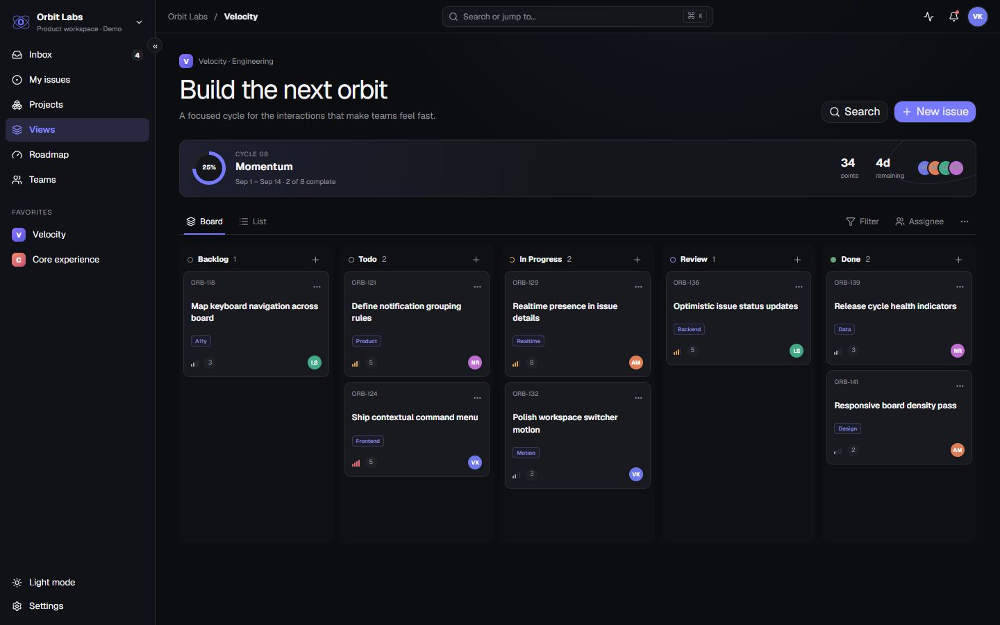
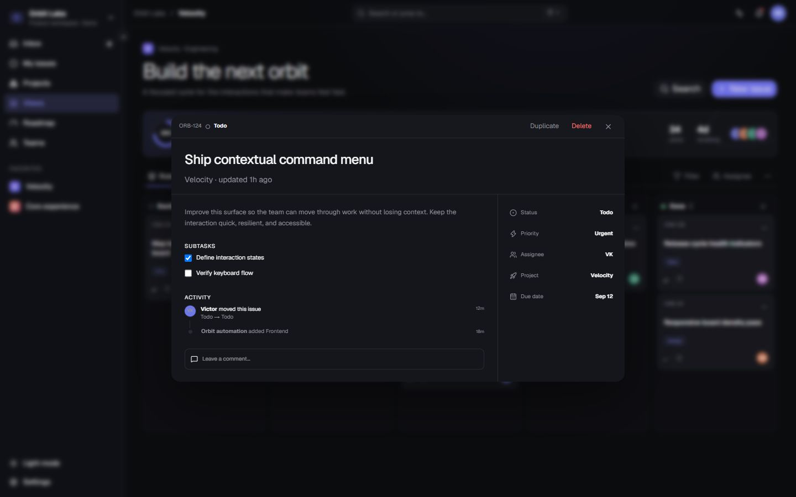
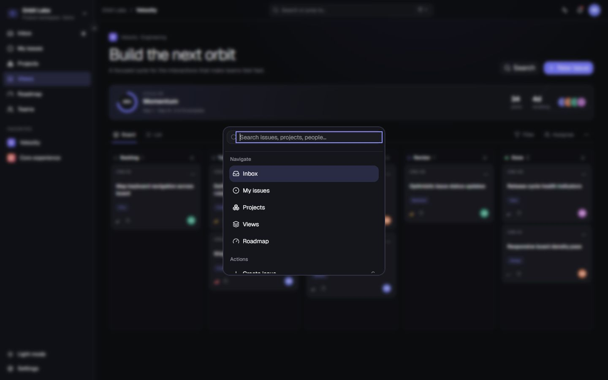
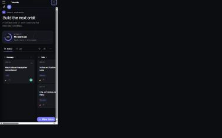

# Orbit

Orbit is a portfolio-grade project operations workspace: fast enough for daily issue work, calm enough for planning, and original in its visual language.

**Live demo:** [orbit-project-ops.vercel.app](https://orbit-project-ops.vercel.app)

## Highlights

- Responsive Kanban with pointer and keyboard drag-and-drop, drop feedback and optimistic updates
- Searchable/sortable issue list plus status and assignee filters
- Rich issue detail with editable title/properties, subtasks, activity, duplicate and delete actions
- Global command palette (`Ctrl/Cmd + K`) and quick-create shortcut (`C`)
- Projects, roadmap, notification inbox, themes and mobile navigation
- Real cycle completion and point totals derived from issue data
- Custom social card, canonical metadata, 404 and production security headers
- Optional Google sign-up/sign-in through Auth.js, with a no-account demo path

## Stack and architecture

Next.js 16 App Router, React 19, TypeScript, Tailwind CSS 4, shadcn primitives, dnd-kit and Supabase-ready data boundaries.

The deployed portfolio uses local client state so reviewers can safely explore every mutation without an account. The production-ready PostgreSQL/RLS contract is versioned in `supabase/migrations`, and Supabase clients live in `lib/supabase`.

## Run locally

```bash
pnpm install
pnpm dev
```

Optional Supabase variables are documented in `.env.example`. Never expose a service-role key through a `NEXT_PUBLIC_` variable.

Google authentication uses Auth.js with JWT sessions. Register `https://orbit-project-ops.vercel.app/api/auth/callback/google` as an authorized Google OAuth redirect URI, then configure `AUTH_SECRET`, `AUTH_GOOGLE_ID`, and `AUTH_GOOGLE_SECRET` in Vercel. No OAuth secret belongs in source control.

## Quality commands

```bash
pnpm lint
pnpm typecheck
pnpm test
pnpm build
pnpm test:e2e
```

`test:e2e` runs a production smoke check against Vercel by default; override it with `ORBIT_BASE_URL`. Final release QA covers keyboard commands, issue creation/editing, board/list switching, filters, drag-and-drop, 404, console errors and responsive widths from 320px to 1920px.

## Portfolio views

- **Board:** cycle metrics, filters and five-stage workflow
- **Issue detail:** editing, properties, subtasks and activity
- **Command menu:** keyboard-first navigation and actions
- **Mobile:** focused navigation drawer and scrollable planning surfaces

### Board



### Issue detail and command menu

| Issue detail                                        | Command menu                                          |
| --------------------------------------------------- | ----------------------------------------------------- |
|  |  |

### Mobile



## Deployment

Vercel is the canonical production host. OpenAI Sites remains a secondary showcase build. Security headers are declared centrally in `next.config.ts`, and the social preview is rendered at `/opengraph-image`.
